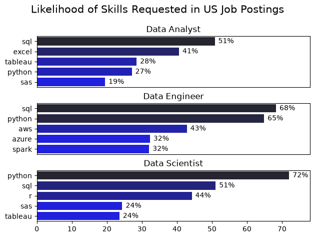
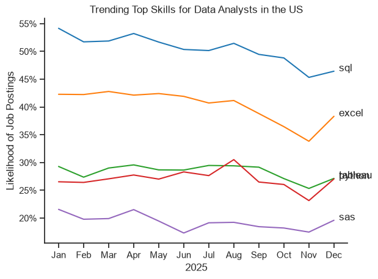
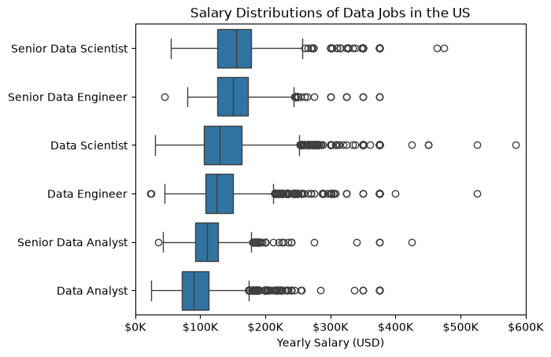

# The Analysis

## 1. What are the most demanded skills for the top 3 most popular data roles?

To find the most demanded skills for the top 3 most popular data roles, I filtered out those positions by which ones were the most popular, and got the top 5 skills for these top 3 roles. This query highlights the most popular job titles and their top skills, showing which skills I should pay attention to depending on the role I'm targeting.

View my notebook with detailed steps here:
[2_Skills_Demand.ipynb](Project\2_Skills_Count.ipynb)


### Visualize Data
```python

fig, ax = plt.subplots(len(job_titles), 1)
for i, job_title in enumerate(job_titles):
    df_plot = df_skills_perc[df_skills_perc['job_title_short'] == job_title].head(5)
    sns.barplot(data=df_plot, x='skill_percent', y='job_skills', ax=ax[i], hue='skill_count', palette='dark:b_r')
    ax[i].set_title(job_title)
    ax[i].set_ylabel('')
    ax[i].set_xlabel('')
    ax[i].get_legend().remove()
    ax[i].set_xlim(0, 78)
    # remove the x-axis tick labels for better readability
    if i != len(job_titles) - 1:
        ax[i].set_xticks([])
    # label the percentage on the bars
    for n, v in enumerate(df_plot['skill_percent']):
        ax[i].text(v + 1, n, f'{v:.0f}%', va='center')

fig.suptitle('Likelihood of Skills Requested in US Job Postings', fontsize=15)
fig.tight_layout(h_pad=.8)
plt.show()
```

### Results



### Insights

- Python is a very versatile skill, highly demanded across all 3 roles, but most prominently for Data Scientists (72%) and Data Engineers (65%).
- SQL is the most requested skill for Data Analysts and Data Scientists, with it in over 50% of the job postings for both roles. For Data Engineers though, Python is the most sought-after skill, appearing in 68% of job postings.
- Data Engineers require more specialized technical skills (AWS, Azure, Spark) compared to Data Analysts and Data Scientists who are expected to be proficient in more general data mangement and analysis tools (Excel, Tableau).

## 2. How are in-demand skills trending for Data Analysts?

### Visualize Data

```python
from matplotlib.ticker import PercentFormatter
df_plot = df_DA_US_percent.iloc[:, :5]

sns.lineplot(data = df_plot, dashes = False, palette = 'tab10', legend= 'full')
sns.set_theme(style = 'ticks')
sns.despine()

plt.title('Trending Top Skills for Data Analysts in the US')
plt.ylabel('Likelihood of Job Postings')
plt.xlabel('2026')
plt.legend().remove()

ax= plt.gca()
ax.yaxis.set_major_formatter(PercentFormatter(decimals = 0))

for i in range(5):
    plt.text(11.2,df_plot.iloc[-1,i],df_plot.columns[i])
plt.show()
```
### Results



*Bar graph visualizing the trending top skills for data analysts in the US in 2025.*

### Insights
- SQL remains the most consistenly demanded skill throughout the year, although it shows a gradual decrease in demand throughout the year.
- Excel experienced a similar trend with SQL, showing a decline in demand and sharper decline starting in August.
- Tableau and Python show relatively stable demand and show the same trend against each other with some fluctuations. In August, Python slightly edges out Tableau during that month, but Tableau bounces back.
- SAS shows a stable trend throughout the year at relatively 20%.

All these technologies are safe for the time being to learn.


## 3a. How well do jobs and skill pay for Data roles: Salary Analysis


### VIsualize Data


```python
job_order = df_US_top6.groupby('job_title_short')['salary_year_avg'].median().sort_values(ascending=False).index    # Groups by median salary so we can get the index and order them in our plot

sns.boxplot(data=df_US_top6, x='salary_year_avg', y='job_title_short', order = job_order)                                 
plt.title('Salary Distributions of Data Jobs in the US')
plt.xlabel('Yearly Salary (USD)')
plt.ylabel('')
plt.xlim(0, 600000) 
ticks_x = plt.FuncFormatter(lambda y, pos: f'${int(y/1000)}K')
plt.gca().xaxis.set_major_formatter(ticks_x)
plt.show()
```

### Results


*Box Plot visualizing the salary distributions for the top 6 data job titles.*

### Insights
- There's a significant variation in salary ranges across different job titles. Senior Data Scientist positions tend to have the highest salary potential, with up to $600K, indicating the high value placed on advanced at skills and experience in the industry.
- Senior Data Engineer and Senior Data Scientist roles show a considerable number of outliers on the higer end of the salary spectrum, suggesting that exceptional skills ro cicumsatnces can lead to high pay in these roles. In contrast, Data Analyst roles demonstrate more consistency in salary, with fewer outliers.
- The median salaries increase wiht the seniority and specialization of the roles. Senior roles (Senior Data Scientist and Senior Data Engineer) not only have higher median salaries, but also larger differences in typical salaries, reflecting greater variance in compensation as responsibilities increase.

## 3b. How well do jobs and skill pay for Data roles: Highest Paid & Most Demanded Skills for Data

### Visualize Data

```python
fig, ax = plt.subplots(2, 1)  

# Top 10 Highest Paid Skills for Data Analysts
sns.barplot(data=df_DA_top_pay, x='median', y=df_DA_top_pay.index, hue='median', ax=ax[0], palette='dark:b_r')
ax[0].legend().remove()

# Top 10 Most In-Demand Skills for Data Analysts')
sns.barplot(data=df_DA_skills, x='median', y=df_DA_skills.index, hue='median', ax=ax[1], palette='light:b')
ax[1].legend().remove()
```
### Results


*2 seperate bar graphs visualizing the highest paid skill sand most in demand skills for Data Analysts in the United States.*

### Insights
- Top graph shows specialized technical skills like `dypler`, `bitbucket`, and `gitlab` are associated with higher salaries, some reaching up to $200K, suggesting that advanced technical proficiency can increase earning potential.
- The bottom graph highlights that foundational skills like `Excel`, `Powerpoint`, and `SQL` are the most in-demand, even though they may not offer the highest salaries. This demonstrates the importance of these core skills for employability in data analyst roles.
- There's a clear distinction between the skills that are highest paid and those that are most in-demand. Data analysts aiming to maximize their career potential should consider developing a diverse skill set that includes both high-paying specialized skills and widely demanded foundational skills.


## 4. What is the most optimal skill to learn for Data Analysts?

### Visualize Data

```python
from adjustText import adjust_text
sns.scatterplot(data = 'df_plot', x = 'skill_percent', y = 'median_salary', hue = 'technology')
sns.set_theme(style = 'ticks')

texts = []
for i, txt in enumerate(df_DA_skills_high_demand.index):
    texts.append(plt.text(df_DA_skills_high_demand['skill_percent'].iloc[i], df_DA_skills_high_demand['median_salary'].iloc[i], " " + txt))

adjust_text(texts, arrowprops=dict(arrowstyle='->', color='gray'))
plt.xlabel('Percent of Data Analyst Jobs')
plt.ylabel('Median Salary ($USD)')  
plt.title('Most Optimal Skills for Data Analysts in the US')

from matplotlib.ticker import PercentFormatter
ax= plt.gca()
ax.yaxis.set_major_formatter(plt.FuncFormatter(lambda y, pos: f'${int(y/1000)}K'))
ax.xaxis.set_major_formatter(PercentFormatter(decimals=0))
plt.show()
```
### Results


*A scatter plot visualizing the most optimal skills (high paying & high demand) for data analysts in the US.*

### Insights
- Scatterplot shows that most of the `programming` skills tend to cluster at higher salary levels compared to other categories, indicating that programming expertise might offer greater salary benefits within the data analytics field.
- Analyst tools, including `tableau` and `power bi`, are prevalent in job postings and offer competitive salaries, showing that visualization and data analysis software are crucial for current data roles. This category not only has good salaries but is also versatile across different types of data tasks.
- The database skills such as `oracle` and `SQL server` are associated with some of the highest salaries among data analyst tools. This indicates a significant demand and valuation for data management and manipulation expertise in the industry.